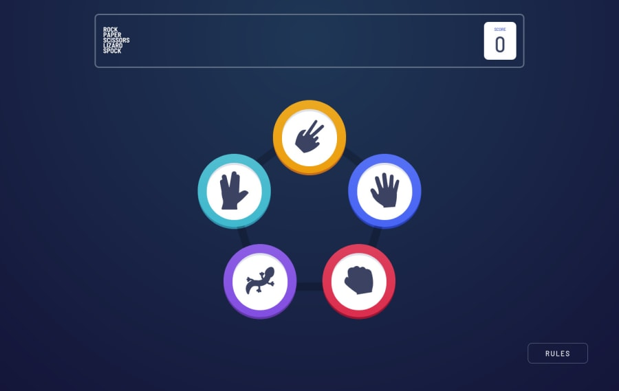

# Frontend Mentor - Rock, Paper, Scissors solution (extended version)

This is a solution to the [Rock, Paper, Scissors challenge on Frontend Mentor](https://www.frontendmentor.io/challenges/rock-paper-scissors-game-pTgwgvgH). Frontend Mentor challenges help you improve your coding skills by building realistic projects. 

## Table of contents

- [Overview](#overview)
  - [The challenge](#the-challenge)
  - [Screenshot](#screenshot)
  - [Links](#links)
- [My process](#my-process)
  - [Built with](#built-with)
- [Author](#author)

## Overview

### The challenge

Users should be able to:

- View the optimal layout for the game depending on their device's screen size
- Play Rock, Paper, Scissors against the computer
- Maintain the state of the score after refreshing the browser
- **Bonus**: Play Rock, Paper, Scissors, Lizard, Spock against the computer

### Screenshot

### Links

- Live Site URL: [https://rock-paper-scissors-game-react.netlify.app](https://rock-paper-scissors-game-react.netlify.app)

## My process

### Built with

- [React](https://reactjs.org/) - JS library
- CSS Modules
- [Redux](https://redux.js.org/) - State Container for JS Apps
- [React Router](https://reactrouter.com/) - Routing

## Author

- Frontend Mentor - [@przemg](https://www.frontendmentor.io/profile/przemg)
